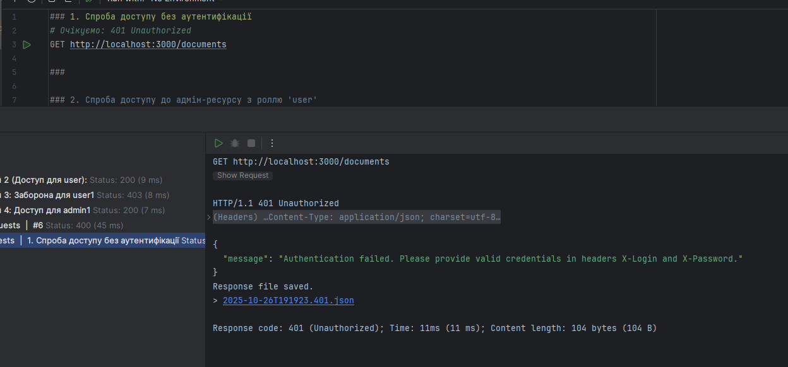
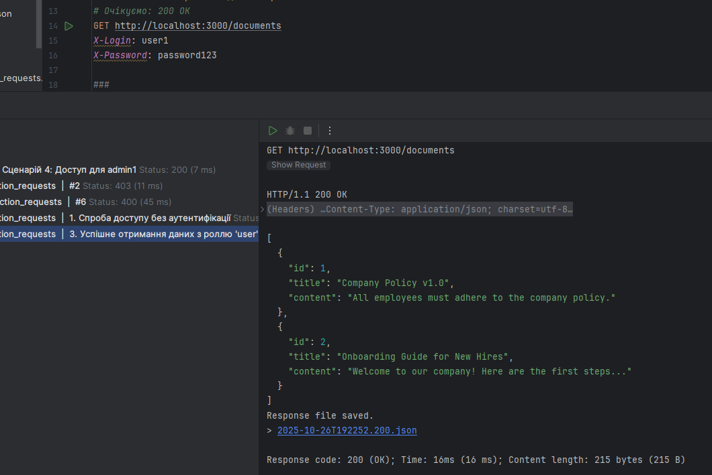
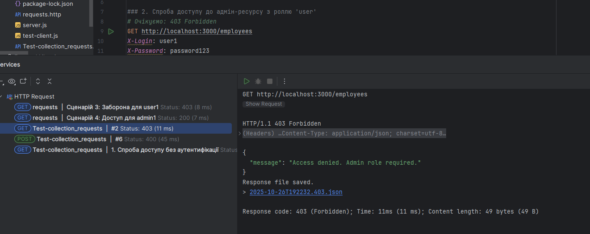
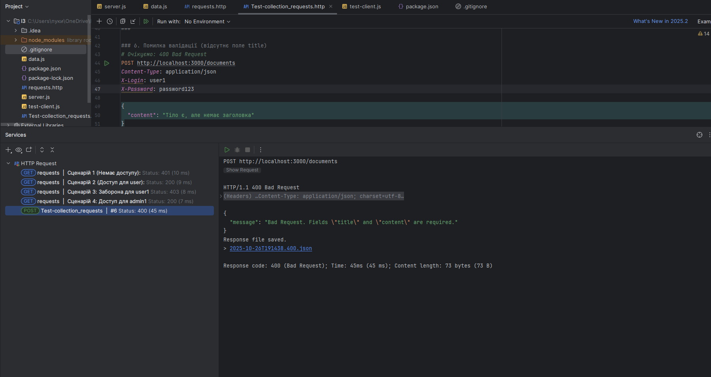
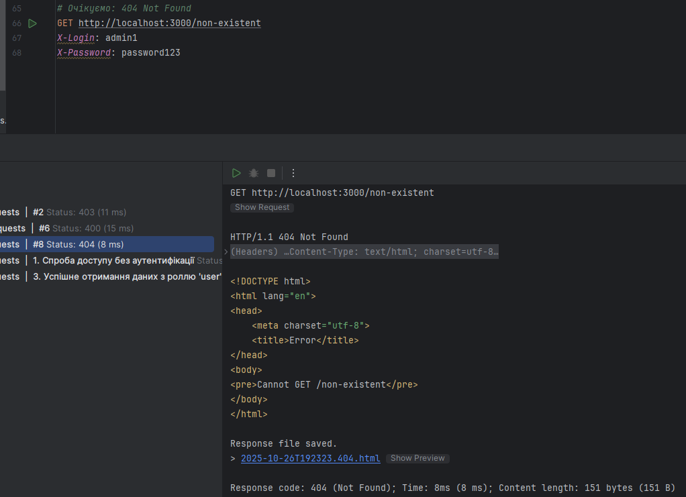

# API для "Захищених документів та співробітників" (L3)

Це простий REST API сервер, створений на **Express.js**, який демонструє базові принципи:
- аутентифікації користувачів;
- розділення прав доступу (**користувач** та **адміністратор**);
- обробки HTTP-запитів до різних ресурсів.

API надає захищені ендпоінти для управління двома ресурсами:
- **Documents** — доступні для всіх аутентифікованих користувачів;
- **Employees** — доступні лише для адміністраторів.

---

##  Встановлення та запуск

### 1. Встановлення залежностей
Відкрийте термінал у кореневій теці проєкту та виконайте:

1. Клонуйте репозиторій:
   ```bash
   git clone https://github.com/fawxxc/secure-api-lab.git
   cd secure-api-lab
   ```

2. Встановіть залежності:
   ```bash
   npm install
   ```

3. Запустіть сервер:
   ```bash
   npm start
   ```

Сервер буде запущено за адресою:
```
http://localhost:3000
```

---
## Тестування

Для запуску тестового клієнта (`test-client.js`):
```bash
npm test
```

---
## Аутентифікація

Кожен запит має містити такі HTTP-заголовки:

| Заголовок | Опис | Приклад |
|------------|-------|----------|
| `X-Login` | Логін користувача | `user1`, `admin1` |
| `X-Password` | Пароль користувача | `password123` |

---

## Ендпоінти API

### Ресурс: Documents

Доступний для будь-якого аутентифікованого користувача.

| Метод | URL | Опис | Body | Коди відповіді |
|--------|------|-------|------|----------------|
| `GET` | `/documents` | Отримати список документів | – | `200 OK`, `401 Unauthorized` |
| `POST` | `/documents` | Створити новий документ | `{ "title": "...", "content": "..." }` | `201 Created`, `400 Bad Request`, `401 Unauthorized` |
| `DELETE` | `/documents/:id` | Видалити документ | – | `204 No Content`, `401 Unauthorized`, `404 Not Found` |

---

### Ресурс: Employees

Доступний лише для користувачів з роллю `admin`.

| Метод | URL | Опис | Коди відповіді |
|--------|------|-------|----------------|
| `GET` | `/employees` | Отримати список співробітників | `200 OK`, `401 Unauthorized`, `403 Forbidden` |

---

### Інші маршрути

| Метод | URL | Опис | Коди відповіді |
|--------|------|-------|----------------|
| `GET` | `/` | Привітальний маршрут | `200 OK` |
| `ANY` | `/non-existent` | Неіснуючий маршрут | `404 Not Found` |

---

## Приклад запиту

```bash
curl -X GET http://localhost:3000/documents \
  -H "X-Login: user1" \
  -H "X-Password: password123"
```

---
## Тестування API

Нижче наведені основні сценарії запитів до API та очікувані відповіді. Скриншоти демонструють роботу в Postman.

| № | Сценарій | Запит | Заголовки | Тіло запиту | Очікувана відповідь | Скриншот |
|---|----------|-------|-----------|------------|-------------------|-----------|
| 1 | 401 Unauthorized | GET /documents | – | – | 401 Unauthorized |  |
| 2 | 200 OK | GET /documents | Authorization: Bearer <user1-token> | – | 200 OK, список документів |  |
| 3 | 403 Forbidden | GET /employees | Authorization: Bearer <user1-token> | – | 403 Forbidden |  |
| 4 | 400 Bad Request | POST /documents | Authorization: Bearer <user1-token><br>Content-Type: application/json | ```json { "title": "Невірні дані" } ``` | 400 Bad Request / Validation Error |  |
| 5 | 404 Not Found | GET /non-existent | будь-які | – | 404 Not Found |  |
---
## Посилання

Репозиторій: [https://github.com/fawxxc/secure-api-lab.git](https://github.com/fawxxc/secure-api-lab.git)
---

